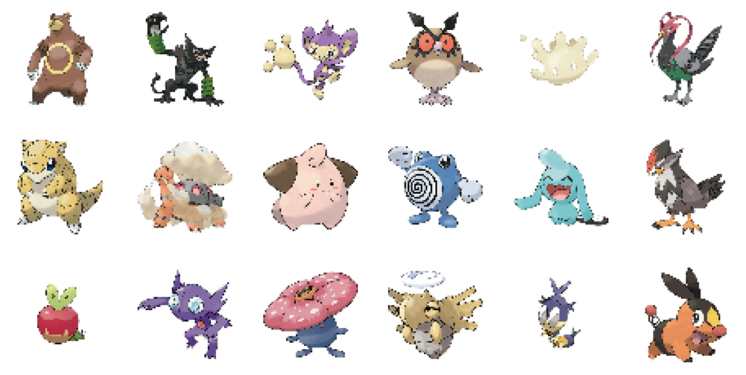
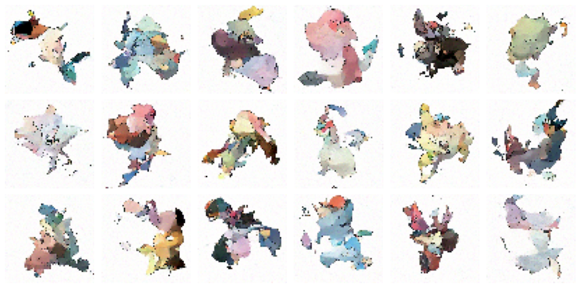

 
 
 

</a> 

 
     
       

# Generated Pokemon

## **About**

The goal of this project is to generate new Pokemon designs using diffusion models. The DDPM and DDIM models are trained on a dataset of existing Pokemon images, and they learn to generate new Pokemon that resemble the existing ones while introducing novel and creative elements.

The repository includes the necessary code and resources to train and utilize the models for generating new Pokemon designs. 

## **Dataset**

All the training data used in this project are from [Pokemon Images Dataset](https://www.kaggle.com/datasets/kvpratama/pokemon-images-dataset). This dataset contains 819 pokemon images, white background in jpg format.

## **Demonstration**
* **Pokemon Dataset:**

* **Generation Output after 50 Epochs:**

## **Reference**
> [1] DDPM paper `https://arxiv.org/pdf/2006.11239.pdf`
>
> [2] DDIM paper `https://arxiv.org/pdf/2010.02502.pdf`
>
> [3] Annotated Diffusion `https://huggingface.co/blog/annotated-diffusion`
>
> [4] pytorch-ddpm `https://github.com/w86763777/pytorch-ddpm/tree/master`
>
> [5] Pytorch Diffusion `https://github.com/quickgrid/pytorch-diffusion`

## **Licence**

This repository is licensed under the Apache-2.0 License - see the [LICENSE](https://github.com/Followb1ind1y/Face-Mask-Detection/LICENSE) file for details.
